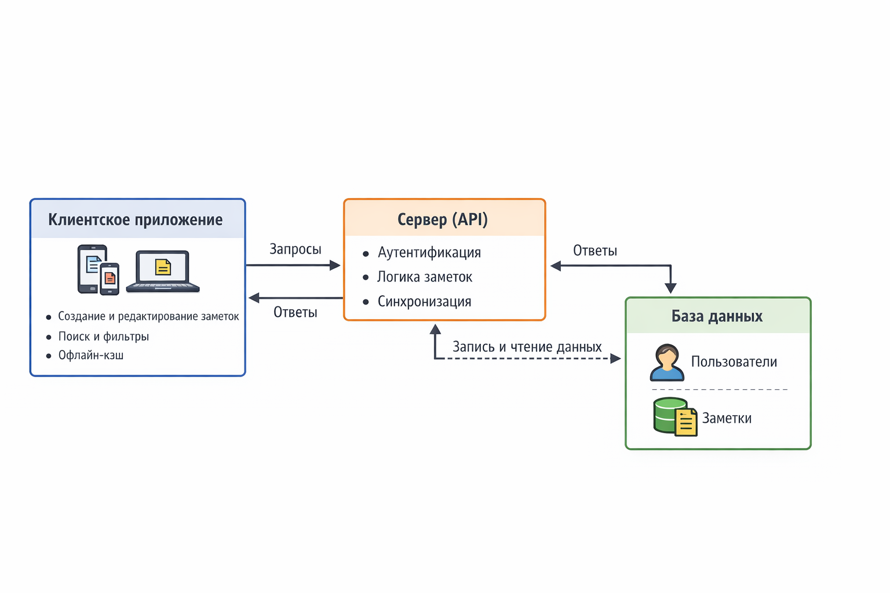
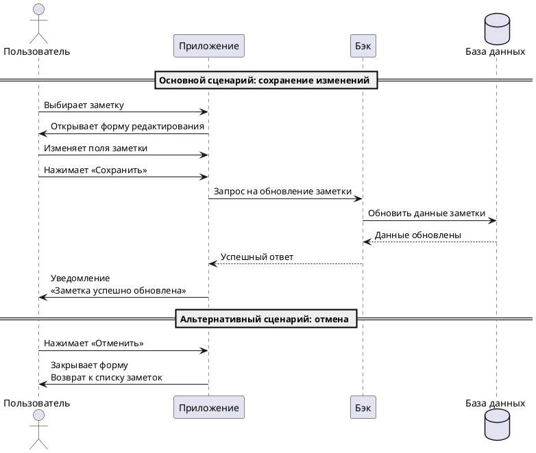

## Архитектура приложения NotesApp

Ниже представлена схема архитектуры приложения NotesApp. На схеме изображена демонстрация взаимодействия клиентского приложения с сервером и базой данных.

### 1️ Клиентское приложение (User Interface)

- Платформы: мобильное (iOS, Android), веб-приложение  
- Основные функции:  
  - Создание и редактирование заметок  
  - Поиск и фильтры по заметкам  
- Взаимодействует с сервером через **API** по HTTPS (REST)  
- Отображает данные в интерфейсе, полученные от сервера

### 2️ Сервер (Backend / API)

- Основная роль: обработка запросов от клиентов и управление данными  
- Функции:  
  - Аутентификация и авторизация пользователей  
  - Обработка запросов для заметок (Create, Read, Update, Delete)  
  - Логика синхронизации между устройствами  
- Общается с:  
  - Клиентским приложением (через API)  
  - Базой данных для хранения пользователей и заметок  

### 3️ База данных (Database)

- Тип: SQL  
- Хранит данные:  
  - **Пользователи:** ID пользователя, email,
  - **Заметки:** ID заметки, user_id, заголовок, содержание, дата создания/изменения  
- Сервер делает запросы к базе для сохранения, обновления и получения данных  

# Пользовательский сценарий «Редактирование заметки»

## Предварительные условия
- Пользователь должен находиться на списке своих заметок.  
- В системе должна существовать хотя бы одна заметка для редактирования.  

## Выходные условия
- В системе изменены данные выбранной заметки.  

## Основной сценарий
1. Пользователь выбирает заметку, которую хочет редактировать.  
2. Приложение открывает форму редактирования заметки.  
3. Пользователь изменяет необходимые поля заметки.  
4. Пользователь нажимает кнопку **Сохранить**.  
5. Приложение отправляет запрос Бэку на обновление заметки.  
6. Бэк обновляет заметку в Базе данных.  
7. Бэк возвращает Приложению ответ об успешном обновлении заметки.  
8. Приложение отображает уведомление пользователю: «Заметка успешно обновлена».  

## Альтернативный сценарий
1. Пользователь выбирает заметку и открывает форму редактирования.  
2. Пользователь вносит изменения, но нажимает кнопку **Отменить**.  
3. Приложение закрывает форму редактирования и возвращает пользователя на главный экран или список заметок без внесённых изменений.

## Диаграмма последовательности

